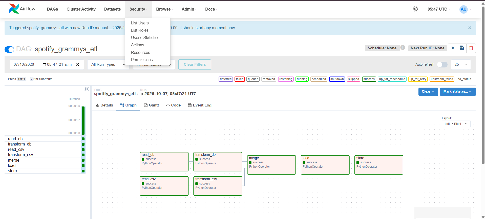
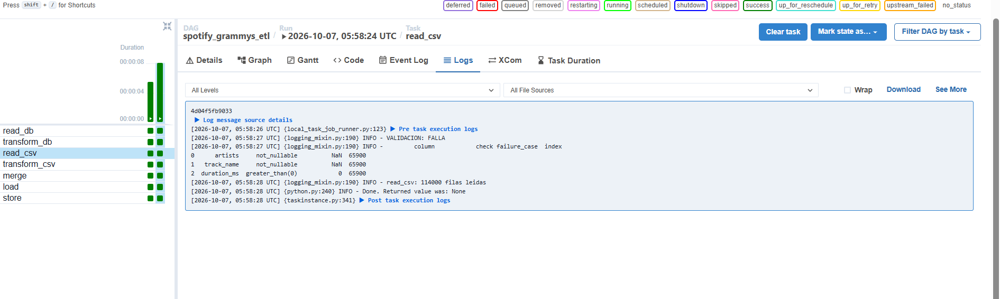
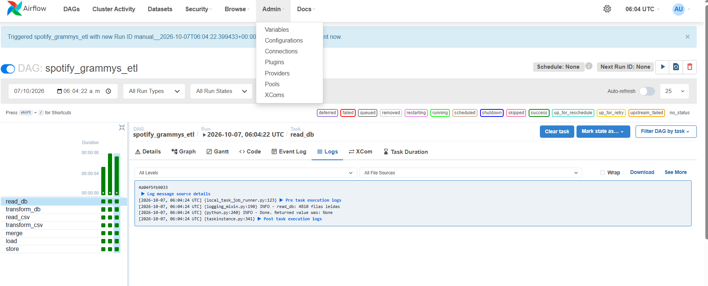
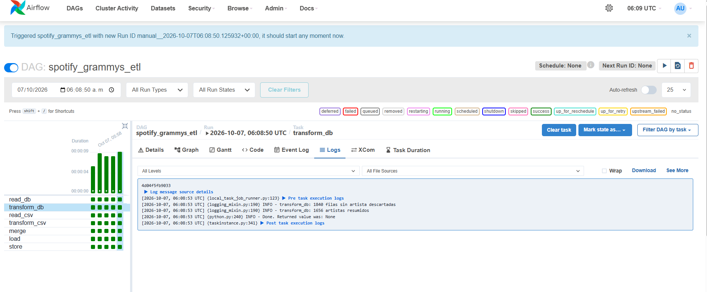
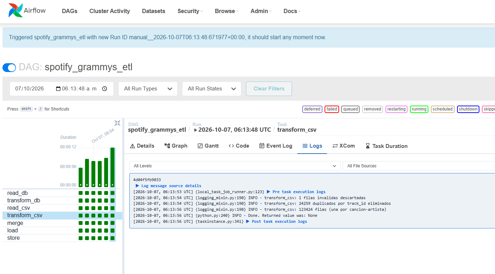

## Validación de calidad (Spotify)

Resultado de `python esquema_calidad.py`:

VALIDACION: FALLA
        column            check failure_case  index
0      artists     not_nullable          NaN  65900
1   track_name     not_nullable          NaN  65900
2  duration_ms  greater_than(0)            0  65900

Fila 65900 (track_id 1kR4gIb7nGxHPI3D2ifs59): `duration_ms` = 0 y `artists` y `track_name` nulos.
Decisión: la fila se registra en el log de validación y se descarta en la transformación.

