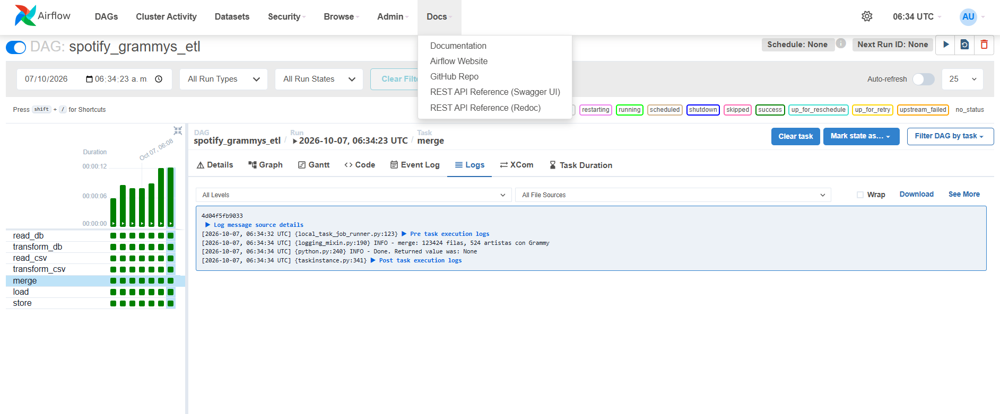
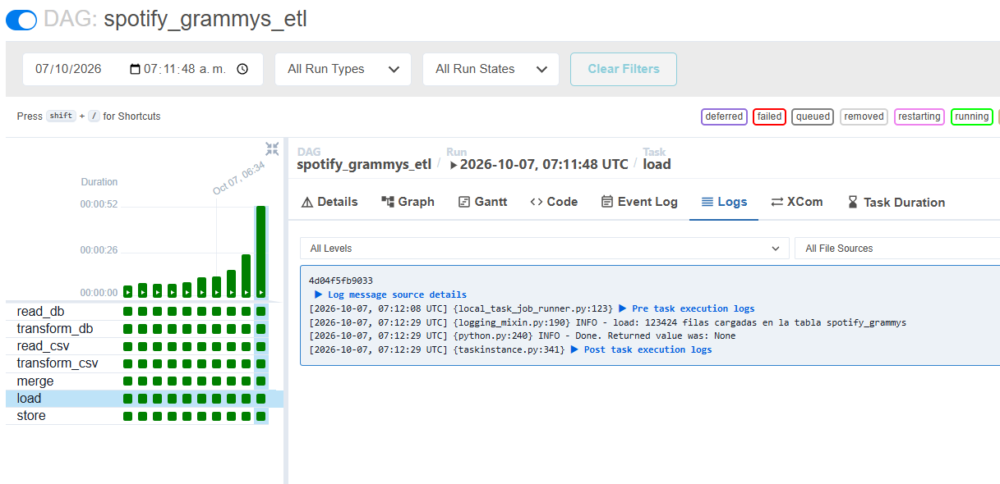
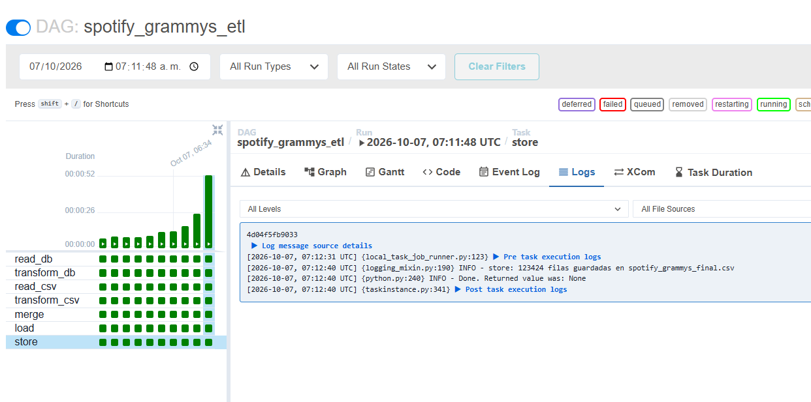
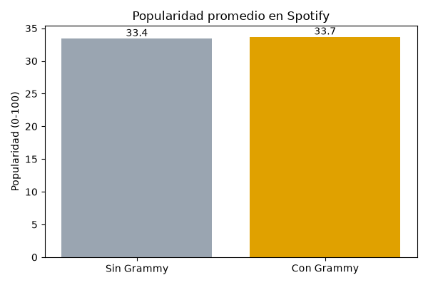
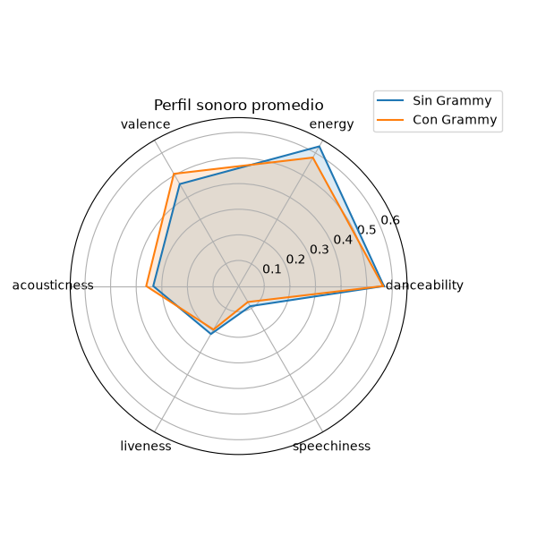
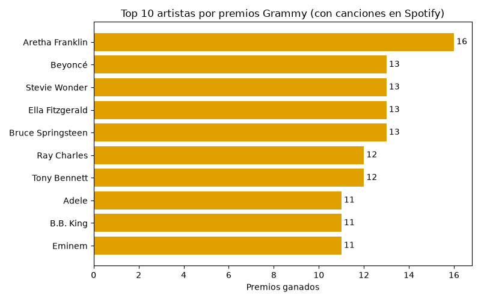
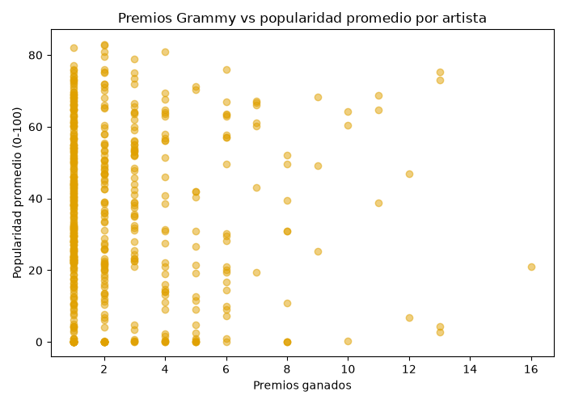

# Workshop 2: Automatización de un pipeline ETL con Apache Airflow

Este proyecto automatiza un pipeline ETL con Apache Airflow para integrar datos de canciones de Spotify (desde un archivo CSV) con información de los Premios Grammy (desde una base de datos). El flujo valida la calidad de los datos con Pandera, limpia y realiza el cruce (merge) de ambas fuentes, y guarda el resultado tanto en una base de datos analítica como en un archivo CSV. Finalmente, genera un reporte gráfico consultando directamente la base de datos resultante.

## Tecnologías

Python, Apache Airflow 2.10.5 (Docker, `LocalExecutor` + Postgres para los metadatos de Airflow), Pandera, pandas, SQLite, matplotlib.

## Estructura del repositorio

```
├── dags/
│   ├── spotify_grammys_dag.py   # DAG de Airflow
│   └── esquema_calidad.py       # Validación con Pandera
├── data/
│   ├── spotify.csv              # Fuente 1 (CSV)
│   ├── grammys.csv              # Datos para crear la base inicial
│   └── spotify_grammys_final.csv  # Resultado del pipeline
├── docs/                        # Gráficos y evidencia (logs, grafo del DAG)
├── db_grammys_initial.py        # Crea la base inicial de Grammys
├── dashboard.py                 # Reporte: gráficos desde la base final
├── reporte.ipynb                # Notebook con el reporte (gráficos desde la base)
├── docker-compose.yml           # Airflow en Docker
└── README.md
```

## Flujo del pipeline


| Tarea | Qué hace |
|---|---|
| `read_db` | Lee la tabla `grammys_raw` de `grammys_initial.db`. |
| `transform_db` | Descarta filas de Grammys sin artista y resume por artista (premios, primer y último año). |
| `read_csv` | Lee `spotify.csv` y ejecuta la validación de calidad (Pandera). |
| `transform_csv` | Descarta filas inválidas y duplicados, y separa los artistas múltiples en una fila por artista. |
| `merge` | Une ambas fuentes por artista (`left` desde Spotify). |
| `load` | Carga el resultado en la tabla `spotify_grammys` de `final_analytics.db`. |
| `store` | Exporta la tabla a `data/spotify_grammys_final.csv`. |

Las dos ramas (Grammys y Spotify) corren por separado y se juntan en `merge`. Las tareas se pasan los datos mediante archivos temporales `data/tmp_*.csv`, que Git ignora.

## Decisiones de diseño

- **Base de datos:** SQLite para los datos del taller, porque no requiere servidor. Postgres se usa solo para los metadatos internos de Airflow.
- **Dataset de Grammys:** contiene únicamente ganadores (las 4.810 filas tienen `winner = True`), por eso se habla de *premios* y no de *nominaciones*. La columna `nominaciones` de la tabla final es igual a `premios`.
- **Llave del merge:** `artist_key`, el nombre del artista en minúsculas y sin espacios sobrantes.
- **Tipo de merge:** `left` desde Spotify, para conservar todas las canciones y poder comparar artistas con y sin Grammy. Los artistas sin premios quedan con 0.
- **Artistas múltiples:** en Spotify el campo `artists` trae varios artistas separados por `;`. Se separan en una fila por artista para poder cruzarlos con Grammys.
- **Duplicados:** la misma canción aparece una vez por género (24.259 `track_id` repetidos). Se conserva la primera aparición, así que cada canción queda con un solo género.
- **Validación sin detener el pipeline:** si la validación falla, se registra en el log y el pipeline sigue; las filas inválidas se descartan en `transform_csv`.

## Validación de calidad (Spotify)

La validación está hecha con Pandera en `dags/esquema_calidad.py` y corre dentro de la tarea `read_csv`. Revisa que `track_id`, `artists` y `track_name` no tengan nulos, que `popularity` esté entre 0 y 100, que `duration_ms` sea mayor que 0 y que `danceability` y `energy` estén entre 0 y 1.

La función `validar_spotify` devuelve si los datos pasan o fallan y, si fallan, qué filas rompieron qué regla. Resultado real sobre el dataset:

```
VALIDACION: FALLA
        column            check failure_case  index
0      artists     not_nullable          NaN  65900
1   track_name     not_nullable          NaN  65900
2  duration_ms  greater_than(0)            0  65900
```

Hallazgo: una sola fila (`65900`, `track_id` `1kR4gIb7nGxHPI3D2ifs59`) tiene `duration_ms` = 0 y `artists` y `track_name` nulos.
**Decisión:** la validación registra la falla en el log pero no detiene el pipeline; la fila se descarta en `transform_csv`.

## Evidencia: logs de cada fase en Airflow

Capturas de los logs de cada tarea en una ejecución exitosa del DAG.

### 1. `read_db`: lectura de Grammys
Lee 4.810 filas de la tabla `grammys_raw`.


### 2. `transform_db`: transformación de Grammys
Descarta 1.840 filas sin artista y resume el resto en 1.656 artistas.


### 3. `read_csv`: lectura de Spotify y validación
Lee 114.000 filas y registra que la validación falla por la fila 65900.


### 4. `transform_csv`: transformación de Spotify
Descarta 1 fila inválida, elimina 24.259 duplicados por `track_id` y separa los artistas múltiples, quedando 123.424 filas (una por canción-artista).


### 5. `merge`: unión de las dos fuentes
123.424 filas resultantes, igual que antes del cruce (no se duplicó nada). Solo **524 de los 1.656 artistas de Grammys** coincidieron con Spotify por nombre.



### 6. `load` y `store`
`load` carga las 123.424 filas en la tabla `spotify_grammys` de `final_analytics.db` y `store` exporta `data/spotify_grammys_final.csv`.





## DASHBOARD

`dashboard.py` consulta con SQL la base `final_analytics.db` (no el CSV) y genera 4 gráficos en `docs/`. De las 123.424 filas, 6.991 (~6%) son de artistas con Grammy, por lo que los dos grupos tienen tamaños muy distintos.

### 1. Popularidad promedio: CON vs SIN Grammy


Las dos barras casi empatan: 33,4 de popularidad promedio para los artistas sin Grammy y 33,7 para los que sí tienen. La diferencia es de apenas 0,3 puntos sobre 100, así que ser un artista premiado no se nota en cuánto se escucha hoy en Spotify. Hay que tener en cuenta que el grupo con Grammy es pequeño (cerca del 6% de las filas), por eso la comparación se interpreta con cuidado.

### 2. Perfil sonoro promedio


Las dos figuras casi se superponen, es decir, la "huella sonora" de los dos grupos es muy parecida. Los artistas con Grammy tienen un poco más de `valence` (canciones algo más alegres) y de `acousticness`, y los que no tienen Grammy un poco más de `energy` y `speechiness`. `danceability` y `liveness` quedan prácticamente iguales. Son diferencias pequeñas, así que no podemos decir que los artistas premiados suenen distinto.

### 3. Top 10 artistas por premios


Aretha Franklin lidera con 16 premios, seguida por Beyoncé, Stevie Wonder, Ella Fitzgerald y Bruce Springsteen con 13 cada uno. Después aparecen Ray Charles y Tony Bennett con 12, y Adele, B.B. King y Eminem con 11. En el top se mezclan artistas de épocas y géneros muy distintos (soul, jazz, rock, pop, rap).
Los números salen del dataset de Grammys (que llega hasta 2019) y solo cuentan artistas que también están en Spotify, así que no son el total histórico oficial.

### 4. Premios vs popularidad


Cada punto es un artista con Grammy y la correlación es de -0,01, prácticamente cero.Podemos decir que tener más premios no se asocia con ser más popular hoy. Se nota en la nube de puntos los artistas con un solo premio van de 0 a cerca de 80 de popularidad, y Aretha Franklin, con 16 premios, ronda los 20. 
Una posible explicación es que muchos premios son de décadas pasadas, mientras que la popularidad de Spotify es más moderna y actual.

**Conclusión general:** en estos datos, la popularidad actual en Spotify no refleja el reconocimiento de los Grammy.

## Cómo ejecutarlo

Requisitos: Python 3.10+, Docker Desktop y Git.

1. Clonar el repositorio y entrar a la carpeta.
2. Verificar que `data/` tenga `spotify.csv` y `grammys.csv` (si no, descargarlos de Kaggle y renombrarlos):
   - Spotify: https://www.kaggle.com/datasets/maharshipandya/-spotify-tracks-dataset
   - Grammys: https://www.kaggle.com/datasets/unanimad/grammy-awards
3. Crear el entorno e instalar dependencias:
```
   python -m venv venv
   venv\Scripts\activate
   pip install -r requirements.txt
```
4. Crear la base inicial de Grammys (genera `data/grammys_initial.db`):
```
   python db_grammys_initial.py
```
5. Inicializar y levantar Airflow:
```
   docker compose up airflow-init
   docker compose up -d
```
6. Abrir http://localhost:8080 (usuario `admin`, contraseña `admin`), activar el DAG `spotify_grammys_etl` y ejecutarlo con **Trigger DAG**.
7. Generar el reporte (lee `data/final_analytics.db`):
```
   python dashboard.py
```
8. Para apagar Airflow: `docker compose down`.

Las bases `.db` no se suben al repositorio (están en `.gitignore`): se regeneran con los pasos 4 y 6.

## Limitaciones

- **Cruce por nombre exacto:** solo 524 de 1.656 artistas coincidieron. Nombres como `Beyoncé featuring Jay-Z` no cruzan con `Beyoncé`, así que el número de artistas con Grammy está por debajo del real.
- **Solo ganadores:** el dataset de Grammys no incluye nominados que no ganaron.
- **Popularidad:** es la popularidad actual de todas las canciones del artista en Spotify, no la de la obra premiada, y los premios llegan hasta 2019. Los resultados muestran asociación, no causalidad.
- **Un solo género por canción:** al eliminar duplicados se conserva la primera aparición.